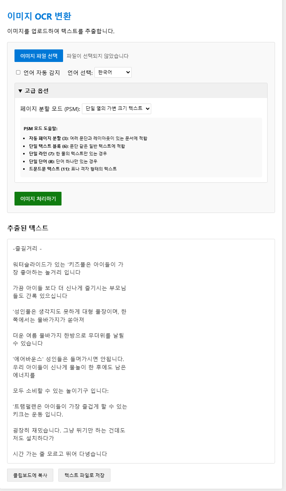

## 설치 요구사항

- Elixir 1.13 이상
- Erlang 24 이상
- Phoenix 1.6 이상
- ImageMagick
- Tesseract OCR 4.0 이상 (언어 패키지 포함)

## 설치 방법

### 1. 의존성 설치

```bash
# Elixir 의존성 설치
mix deps.get
mix deps.compile

# 자바스크립트 의존성 설치
cd assets
npm install
cd ..
```

### 2. Tesseract OCR 설치

```bash
# Ubuntu/Debian 계열
sudo apt-get update
sudo apt-get install tesseract-ocr
sudo apt-get install tesseract-ocr-kor tesseract-ocr-eng tesseract-ocr-jpn tesseract-ocr-chi-sim

# macOS
brew install tesseract
brew install tesseract-lang

# Windows
# 공식 웹사이트에서 설치 프로그램 다운로드 후 설치
# https://github.com/UB-Mannheim/tesseract/wiki
```

### 3. ImageMagick 설치

```bash
# Ubuntu/Debian 계열
sudo apt-get install imagemagick

# macOS
brew install imagemagick

# Windows
# 공식 웹사이트에서 설치 프로그램 다운로드 후 설치
# https://imagemagick.org/script/download.php
```

### 4. 서버 실행

```bash
mix phx.server
```